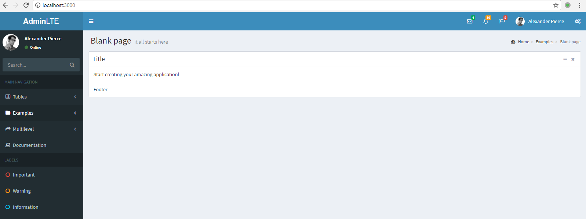

# Examples for Node.js


## [Websocket Example](./websocket)

this example use three type of websocket server implementation

socket.io and sockjs are all implements a weird, arbitrary layer over the WebSocket protocol, which need server side support.


### Server:
sockjs https://github.com/sockjs/sockjs-node  
raw websocket server https://github.com/websockets/ws   
socket.io https://github.com/socketio/socket.io (did not work, no error, no request if use path option, the api is not good)

### Client(Node.js)
https://github.com/websockets/ws  
Server connect to [Echo test](ws://echo.websocket.org) see http://websocket.org/echo.html  

### Client(Browser):
HTML5    https://docs.microsoft.com/en-us/previous-versions/windows/internet-explorer/ie-developer/dev-guides/hh673567(v=vs.85)
https://github.com/sockjs/sockjs-client   
https://github.com/socketio/socket.io-client (the path option did not work)


https://stackoverflow.com/questions/5510537/websocket-library-for-browsers


### Client:  
#### develop:  
use proxy to access express server  
proxy also work with websocket protocol  

### How To Run
#### Server
```shell  
npm run dev  
```

#### Client  
```shell
cd src/client  
npm start  
```

## [Nuxt with Expressjs](./nuxt_express)
Server side rendering by [next.js](https://github.com/nuxt/nuxt.js) associating with expressjs   
using [AdminLTE](https://github.com/almasaeed2010/AdminLTE/) which depend on [bootstrap@3](https://getbootstrap.com/) and [jquery](https://jquery.com/)  
create with template[express-template](https://github.com/nuxt-community/express-template)  
it works much better than next.js and have better document for now. But..., still a tentative way to me. Have not much confidence to use it in real production.
### problems:
- the eslint --fix did not fix the error, so I ignore all the source  in the .eslintignore
### how to run
go the folder, run ```npm install``` then run ```npm run dev```


## [Next.js with Expressjs](./nextjs_express)
Server side rendering by [next.js](https://github.com/zeit/next.js) associating with expressjs  
using [AdminLTE](https://github.com/almasaeed2010/AdminLTE/)
### The Problem
I have the problem as same as [nextjs custom server build size is too big
](https://stackoverflow.com/questions/48572022/nextjs-custom-server-build-size-is-too-big)
- after ```npm build```, then ```npm start``` which with NODE_ENV = production, the main.js is still 1.2M, and there are hot reloading, it seems the production env did not work.
- there are not much resource to find the answer to eresolve the problem.  

so for now, I will not update the example until there are more progress of the popularity of the next.

## [Meteor Examples](./meteor)  
### How to run
please see the shell [run-dev.sh](./meteor/run-dev.sh), change the environment variable in the shell then run from the meteor project folder
`bash ./run-dev.sh`
### Collections and pub/sub methods  
#### [pubsub1](./meteor/imports/pubsub1/client/pubsub1.js)  
subscribe to mongolist, render with react and Tracker.autorun.  
use methods to update.
#### [pubsub2](./meteor/imports/pubsub2/client/pubsub2.js)  
subscribe to mongolist, render with withtrack.  
use methods to update.  
#### [pubsub3](./meteor/imports/pubsub3/client/pubsub3.js)  
subscribe to customer collection, which actually is a local collection  
### UI and theme
#### [login](./meteor/imports/ui/account1/login.js)   
show how to use meteor accounts-password to login
#### [newuser](./meteor/imports/ui/account1/newuser.js)  
show how to use meteor accounts-password to create a new user by email and password
#### [transaction](./meteor/imports/transaction1/client/transaction1.js)  
show how use mongo dirver 3.1 api to do transaction, it will make the publication know the change, but there will be an obviously time gap and the meteor native collection will not affected by the transaction as they are in another database connection.
NOTE:as transaction only work in a [replica set(mongo 4.0)](https://docs.mongodb.com/manual/tutorial/deploy-replica-set/). so will have error like [Transaction numbers are only allowed on a replica set member](https://stackoverflow.com/questions/51461952/mongodb-v4-0-transaction-mongoerror-transaction-numbers-are-only-allowed-on-a) when you run in local machine with one mongo node. 
#### [dashboard](./meteor/imports/ui/dashboard/main.js)   
show how to apply theme layout of [Material Dashboard](https://demos.creative-tim.com/material-dashboard/docs/2.0/getting-started/introduction.html#docs),
also show do logout of the account 

### Conclusion  
tried local collection without mongodb, it will not publish the change across the connections as each collection
is a local collection.

So, use mongodb if you using meteor, otherwise, most feature dispear!!!


### problems:

#### func is not a function
see https://github.com/aldeed/meteor-collection2-core/issues/30, 
just remove aldeed:simple-schema from .meteor/packages and .meteor/versions
and import:  
`import SimpleSchema from 'simpl-schema';` instead


## [Miscellaneous Examples](./misc_examples)

### module cycle require
refer to this article [ES modules: A cartoon deep-dive](https://hacks.mozilla.org/2018/03/es-modules-a-cartoon-deep-dive/)  

but we should not mess our code up like such a require relation.
#### Run: 
go into folder misc_examples\src\module_cycle_require
```shell
node .\m_a.js
```

